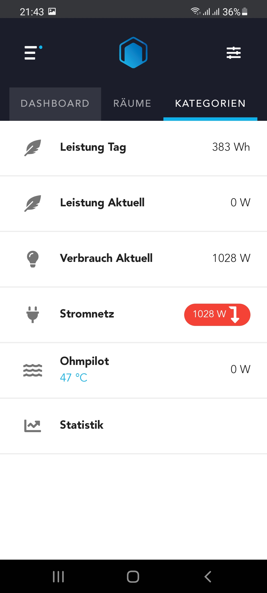

# rematic (REmote Web Frontend for HomeMATIC)

rematic kann als web-basierte Steuerungsoberfläche für Homematic-Installationen genutzt werden. Die Web-App ist responsive und somit für den Einsatz im Desktop-Browser wie Mobilgeräten gleichermaßen geeignet. Im Gegensatz zu bestehenden Alternativen wie _WebMatic_, _RedMatic WebApp_ oder _Yahui_ wird die Oberfläche komplett frei konfiguriert und ist somit sehr universell einsetzbar.

Die Mechanik der Konfiguration der Web-App in Node-Red ähnelt dabei dem Node-Red-Dashboard. Über Seiten (UI Page) werden Gruppen zusammengefasst (UI Group), die wiederum aus Elementen (UI Element) bestehen, welche an Systemvariablen, Geräten oder Programmen aus Homematic gebunden werden können. Neben der Homematic-Anbindung gibt es für die Elemente noch eine generische "DATA"-Schnittstellte, mit der generische Daten an die App übergeben werden können (z.B. Buttons, die beim Drücken ein Message-Event in NodeRED erzeugen, Diagrammdaten oder eine individuelle Benutzeroberfläche über HTML). 

Die App ist dabei in die Tabs _Dashboard_ mit Favoriten, _Räume_ sowie _Kategorien_ gegliedert. 

__Hinweis__

rematic ist für die Verwendung mit [REDmatic](https://github.com/hobbyquaker/RedMatic) optimiert. Das Backend bzw. die Kommunikation mit der CCU basiert auf der [REDmatic WebApp](https://github.com/rdmtc/RedMatic-WebApp).

__Work in Progress__ Dieses Projekt befindet sich noch in einem frühen Entwicklungsstadium und ist als Alpha-Software zu betrachten. Viele der spezielleren Homematic-Geräte wie Heizungssteuerung, etc. sind noch nicht implementiert. Die Steuerung von den Basistypen (Lichter, Schalter, Taster, etc.) sowie von Systemvariablen und Programmen ist jedoch möglich.

## Installation

In der derzeitigen Phase ist der Node noch nicht via NPM verfügbar, deshalb muss der Node manuell installiert werden.

Nuget-Package builden mittels Befehl

```
npm install
cd webapp
npm install
cd ..
npm run build
npm run pack
```

Das erzeugte Package auf die CCU in das Verzeichnis /usr/local/addons/redmatic/var kopieren und dort manuell installieren:

```
source /usr/local/addons/redmatic/home/.profile
cd /usr/local/addons/redmatic/var
npm install rematic-webapp-x.x.x.tgz
```

## Dokumentation Nodes

### _WebApp_

Den Knoten _WebApp_ zu einem Flow hinzufügen. Danach die Seiten mit Gruppen und Elementen konfigurieren und mit dem Eingang des _WebApp_-Nodes verbinden.

Über den App-Namen können mehrere Visualisierung angelegt werden, z.B. eine für Gäste. Über die Option "Eigener Webserver" kann die Web-App über einen separaten Port ausgeliefert werden. Das hilft bspw. wenn man über den eigenen Router ein Port Forwarding von außen einrichten möchte, ohne dabei das komplette NodeRED nach außen hin zugreifbar zu machen. Bitte in diesem Fall immer auf SSL-Verschlüsselung (PEM-Zertifikaten können im Config-Node "Eigener Webserver" hinterlegt werden) sowie ein starkes Passwort setzen.

#### Ausgänge

Als Ausgänge stellt der Node zwei Events zur Verfügung: Einerseits ein Event, welches feuert sobald sich ein Client verbindet. Dies kann beispielsweise dazu genutzt werden, um Daten zu aktualisieren oder einen REGA-poll auszulösen. Andererseits ein Event, das aufgerufen wird wenn ein Client eine Message schickt. Dazu zählen einerseits Navigationsevents (= User wechselt auf eine bestimmte Seite) oder aber auch Messages, die über Elemente (siehe später) konfiguriert werden. Diese Events können dazu genutzt werden, um umfangreiche Daten nur zu laden, wenn eine bestimmte Seite aufgerufen wird (z.B. Diagrammdaten); oder in NodeRED eine Aktion auszuführen, wenn in der WebApp ein Button gedrückt wurde.

#### Eingänge

Generell erhält die App alle Homematic-Updates über _REDmatic_ automatisiert. Es ist aber auch möglich, manuell Updates und Nachrichten an das Frontend zu schicken. 

Um beispielsweise manuell Homematic-Updates zu schicken, jeweils eine Message mit topic _sysvar_, _channel_ und _program_ an den Eingang des Nodes senden. Somit lassen sich beispielsweise Status-Updates zu Hue-Lampen schicken, obwohl dessen Status von Homematic nicht getrackt wird.

Desweiteren können Daten mittels der "DATA"-Schnittstelle an den Eingang übergeben werden, z.B. Diagrammdaten, Message-Buttons oder HTML-Code (Beschreibung später). So können auch andere Systeme in die App miteingebunden werden (z.B. eine SONOS-Anbindung).

### Seiten (_UI Page_)

Mit diesem Node lassen sich in den Tabs _Räume_ und _Kategorien_ Unterseiten erstellen. Dazu einfach den Node auf die Arbeitsfläche ziehen, wählen welchem Tab er zugeordnet werden soll, und mit dem _WebApp_-Node verbinden.

Beim Dashboard als Schnellzugriffsmöglichkeit gibt es nur die Möglichkeit eine einzelne Seite zu definieren, die Benennung dieser ist egal.

#### Ausgänge

Der Ausgang muss mit dem _WebApp_-Node verbunden werden. 

#### Eingänge

Als Eingang fungieren UI-Gruppen (siehe nächster Abschnitt).

### UI-Gruppen (_UI Group_)

In einer UI Gruppe wird entweder eine Kachel in der Rasteransicht oder eine Zeile bei Listenansicht zusammengefasst. Eine UI-Gruppe besteht aus dem Anzeigenamen, einem Icon sowie einem Status (_UI Element_ mit Typ Status) oder mehreren Controls (_UI Element_ mit Typ Control). Dabei wird üblicherweise ein _UI Element_ auch als ein Control im Frontend angezeigt. Ausnahme sind die Homematic-Geräte, wo die App basierend auf dem Gerätetyp von sich aus mehrere Controls anzeigt (z.B. Rolladen mit Buttons Zu, Stop, Auf).

Als Icons können FontAwesome Icons verwendet werden. Die App liefert jedoch auch ein Set an eigenen Icons, die ebenfalls verwendet werden können.

#### Ausgänge

Der Ausgang muss mit einem _UI Page_-Node verbunden werden. 

#### Eingänge

Als Eingang fungieren UI-Elemente (siehe nächster Abschnitt).

Mit den Einstellungen kann das Aussehen der Gruppe verändert werden. Icon (FontAwesome oder eigenes Icon-Set beginnend mit "/Assets/").

Verwendung der "DATA"-Schnittstelle:
Ist als Typ der Gruppe "Raster" oder "Liste" ausgewählt, so wird der HTML-Code anstatt der Controls gerendert. Ist als Typ "Freies HTML" ausgewählt, so wird das Element über die gesamte Breite der Anwendung platziert und kann mittels HTML oder CSS frei definiert werden. Ist als Typ "Diagramm" ausgewählt, so wird die Gruppe als Diagramm gerendert. Bitte beachten, dass hier beim Verbindung oder beim Aufrufen der dazguehörigen Seite Diagrammdaten an die App übergeben werden müssen (siehe Beispielflow). Für die Diagramminteraktion können weitere Elemente (z.B. Message-Buttons, siehe nächster Abschnitt) mit dem Eingang der Diagramm-Gruppe verbunden werden.

### UI-Elemente (_UI Element_)

Verwendung von Homematic:
UI-Elemente werden an Systemvariablen, Geräten oder Programmen von Homematic gebunden. Sie können dabei entweder gesteuert werden (Typ "Control") oder als Status dienen (Typ "Status"). Im Feld Quelle/Ziel kann mittels Auto-Vervollständigung aus allen bekannten Homematic-Elementen gewählt werden, ein Loading-Indicator rechts neben dem Feld zeigt an, wann das Laden der Homematic-Elemente abgeschlossen ist.

Verwendung der "DATA"-Schnittstelle:
(1) DATA:MSG, welche in der Web-App als Buttons gerendert werden und bei Betätigung eine Message an NodeRED auslösen (vgl. WebApp-Node Ausgänge), 
(2) DATA:HTML für das Rendern einer individuellen Benutzeroberfläche für dieses Element
(3) DATA für generische Daten wie bspw. Diagrammdaten (siehe Beispielflow)

Unter "Parameter" können Zusatzinformationen übergeben werden, die je nach Typ des gewählten Homematic-Elements greifen. Eine Dokumentation dieser folgt noch.

Die Definition eines "Icon" ist nur bei Controls, die als Button dargestellt werden, notwendig (Programme oder Geräte mit Typ Key).

Der Name dient zur Organisation und wird in der App nicht dargestellt.

#### Ausgänge

Der Ausgang muss mit einem _UI Group_-Node verbunden werden. 

## Beispiel-Flow "Einfach"

<details><summary>
Beispiel-Flow für REDmatic
</summary>
  
```
[{"id":"ba98bd10.7450a","type":"tab","label":"rematic Demo Basic","disabled":true,"info":""},{"id":"c5e8ee2c.efc15","type":"rematic-uipage","z":"ba98bd10.7450a","name":"Favoriten","parent":"Dashboard","icon":"","link":"","show":"true","order":0,"x":580,"y":160,"wires":[["b595d09.520983"]]},{"id":"4014542f.722e9c","type":"rematic-uipage","z":"ba98bd10.7450a","name":"Wohnraum","parent":"Räume","icon":"assets/Favorit.png","link":"","show":"true","order":0,"x":570,"y":340,"wires":[["b595d09.520983"]]},{"id":"126a3d30.1b2143","type":"rematic-uipage","z":"ba98bd10.7450a","name":"Licht","parent":"Kategorien","icon":"assets/Licht.png","link":"","show":"true","order":0,"x":590,"y":580,"wires":[["b595d09.520983"]]},{"id":"8501edaf.7a593","type":"rematic-uigroup","z":"ba98bd10.7450a","name":"Licht","icon":"assets/Licht.png","link":"/categories/Licht","displayType":"tile","order":0,"x":370,"y":160,"wires":[["c5e8ee2c.efc15"]]},{"id":"470b4ba1.7a9614","type":"rematic-uigroup","z":"ba98bd10.7450a","name":"Alle Lichter","icon":"fas fa-lightbulb","link":"","displayType":"row","order":0,"x":370,"y":340,"wires":[["4014542f.722e9c"]]},{"id":"361fd5e8.f4060a","type":"rematic-uigroup","z":"ba98bd10.7450a","name":"Wohnraum","icon":"fas fa-lightbulb","link":"","displayType":"row","order":"1","x":370,"y":580,"wires":[["126a3d30.1b2143"]]},{"id":"8c7eedfb.48177","type":"rematic-uielement","z":"ba98bd10.7450a","ccuConfig":"38263145.35ea0e","name":"","source":"PROGRAM|Test Programm","icon":"fas fa-rocket","order":0,"displayType":"control","x":120,"y":160,"wires":[["8501edaf.7a593"]]},{"id":"2cbbe12e.884c6e","type":"rematic-uielement","z":"ba98bd10.7450a","ccuConfig":"38263145.35ea0e","name":"","source":"PROGRAM|Test Programm","icon":"fas fa-rocket","order":0,"displayType":"control","x":120,"y":340,"wires":[["470b4ba1.7a9614"]]},{"id":"bdcf003a.56ea","type":"rematic-uielement","z":"ba98bd10.7450a","ccuConfig":"38263145.35ea0e","name":"","source":"PROGRAM|Test Programm","icon":"fas fa-rocket","order":0,"displayType":"control","x":120,"y":580,"wires":[["361fd5e8.f4060a"]]},{"id":"5749318d.23e6e","type":"comment","z":"ba98bd10.7450a","name":"Dashboard","info":"Dashboard","x":580,"y":100,"wires":[]},{"id":"d4fc9e7d.20b89","type":"comment","z":"ba98bd10.7450a","name":"Räume","info":"","x":590,"y":280,"wires":[]},{"id":"ca47b894.1a6558","type":"comment","z":"ba98bd10.7450a","name":"Kategorien","info":"","x":580,"y":520,"wires":[]},{"id":"5d6db288.4fc84c","type":"rematic-uipage","z":"ba98bd10.7450a","name":"Küche","parent":"Räume","icon":"assets/Favorit.png","link":"","show":"true","order":"1","x":590,"y":380,"wires":[["b595d09.520983"]]},{"id":"77839fc1.dc39","type":"rematic-uigroup","z":"ba98bd10.7450a","name":"Alle Lichter","icon":"fas fa-lightbulb","link":"","displayType":"row","order":0,"x":370,"y":380,"wires":[["5d6db288.4fc84c"]]},{"id":"e8d90584.85a248","type":"rematic-uielement","z":"ba98bd10.7450a","ccuConfig":"38263145.35ea0e","name":"Schaltaktor","source":"CHANNEL:SWITCH|Wohnraum Licht Essen|OEQ0000000:3","icon":"fas fa-rocket","order":0,"displayType":"control","x":100,"y":380,"wires":[["77839fc1.dc39"]]},{"id":"9d87a206.1d68","type":"rematic-uigroup","z":"ba98bd10.7450a","name":"Licht Arbeitsplatte","icon":"fas fa-lightbulb","link":"","displayType":"row","order":"1","x":350,"y":420,"wires":[["5d6db288.4fc84c"]]},{"id":"d15c2148.341c6","type":"rematic-uielement","z":"ba98bd10.7450a","ccuConfig":"38263145.35ea0e","name":"Schaltaktor","source":"CHANNEL:SWITCH|Wohnraum Licht Essen|OEQ0000000:3","icon":"","order":"1","displayType":"control","x":100,"y":420,"wires":[["9d87a206.1d68"]]},{"id":"9e16efa5.fc7e7","type":"rematic-uipage","z":"ba98bd10.7450a","name":"Beschattung","parent":"Kategorien","icon":"assets/Beschattung_Sonnenschutz.png","link":"","show":"true","order":0,"x":610,"y":620,"wires":[["b595d09.520983"]]},{"id":"975719b0.a48a98","type":"rematic-uigroup","z":"ba98bd10.7450a","name":"Wohnraum","icon":"fas fa-lightbulb","link":"","displayType":"row","order":"1","x":370,"y":620,"wires":[["9e16efa5.fc7e7"]]},{"id":"fcc10feb.0539e","type":"rematic-uielement","z":"ba98bd10.7450a","ccuConfig":"38263145.35ea0e","name":"Jalousieaktor","source":"CHANNEL:JALOUSIE|Raffstore|PEQ0000000:1","icon":"fas fa-rocket","order":0,"displayType":"control","x":110,"y":620,"wires":[["975719b0.a48a98"]]},{"id":"73b6a430.cd588c","type":"rematic-uielement","z":"ba98bd10.7450a","ccuConfig":"38263145.35ea0e","name":"Jalousieaktor Status","source":"CHANNEL:JALOUSIE|Raffstore|PEQ0000000:1","icon":"fas fa-rocket","order":0,"displayType":"status","x":130,"y":660,"wires":[["975719b0.a48a98"]]},{"id":"b595d09.520983","type":"rematic-webapp","z":"ba98bd10.7450a","ccuConfig":"38263145.35ea0e","name":"demo-basic","token":"rematic1234","server":"","x":900,"y":260,"wires":[["de438b4d.7a5878"],["5d7dcd11.716604"]]},{"id":"de438b4d.7a5878","type":"debug","z":"ba98bd10.7450a","name":"WebApp Connected Event","active":true,"tosidebar":true,"console":false,"tostatus":false,"complete":"true","targetType":"full","statusVal":"","statusType":"auto","x":1180,"y":240,"wires":[]},{"id":"5d7dcd11.716604","type":"debug","z":"ba98bd10.7450a","name":"WebApp Messages","active":true,"tosidebar":true,"console":false,"tostatus":false,"complete":"true","targetType":"full","statusVal":"","statusType":"auto","x":1150,"y":280,"wires":[]},{"id":"b11a1984.8970e8","type":"change","z":"ba98bd10.7450a","name":"Fake Device","rules":[{"t":"set","p":"payload","pt":"msg","to":"{\t   \"topic\":\"localhost/BidCos-RF/Raffstore/LEVEL_SLATS\",\t   \"payload\":0,\t   \"ccu\":\"localhost\",\t   \"iface\":\"BidCos-RF\",\t   \"device\":\"PEQ0000000\",\t   \"deviceName\":\"Raffstore\",\t   \"deviceType\":\"HM-LC-Ja1PBU-FM\",\t   \"channel\":\"PEQ0000000:1\",\t   \"channelName\":\"Raffstore\",\t   \"channelType\":\"JALOUSIE\",\t   \"channelIndex\":1,\t   \"datapoint\":\"LEVEL_SLATS\",\t   \"datapointName\":\"BidCos-RF.PEQ0000000:1.LEVEL_SLATS\",\t   \"datapointType\":\"FLOAT\",\t   \"datapointMin\":0,\t   \"datapointMax\":1,\t   \"datapointDefault\":0,\t   \"datapointControl\":\"JALOUSIE.LEVEL_SLATS\",\t   \"value\":0.5,\t   \"valuePrevious\":1,\t   \"valueStable\":0,\t   \"rooms\":[\"Wohnraum\"],\t   \"room\":\"Wohnraum\",\t   \"functions\":[],\t   \"change\":true,\t   \"cache\":false,\t   \"uncertain\":false,\t   \"working\":false,\t   \"direction\":0,\t   \"stable\":true,\t   \"_msgid\":\"1f99582.ba36aa8\"\t}","tot":"jsonata"},{"t":"set","p":"topic","pt":"msg","to":"event","tot":"str"}],"action":"","property":"","from":"","to":"","reg":false,"x":830,"y":60,"wires":[["b595d09.520983"]]},{"id":"d9a3c96c.8a6948","type":"change","z":"ba98bd10.7450a","name":"Fake Device","rules":[{"t":"set","p":"payload","pt":"msg","to":"{\t   \"topic\":\"localhost/BidCos-RF/Raffstore/LEVEL\",\t   \"payload\":0,\t   \"ccu\":\"localhost\",\t   \"iface\":\"BidCos-RF\",\t   \"device\":\"PEQ0000000\",\t   \"deviceName\":\"Raffstore\",\t   \"deviceType\":\"HM-LC-Ja1PBU-FM\",\t   \"channel\":\"PEQ0000000:1\",\t   \"channelName\":\"Raffstore\",\t   \"channelType\":\"JALOUSIE\",\t   \"channelIndex\":1,\t   \"datapoint\":\"LEVEL\",\t   \"datapointName\":\"BidCos-RF.PEQ0000000:1.LEVEL\",\t   \"datapointType\":\"FLOAT\",\t   \"datapointMin\":0,\t   \"datapointMax\":1,\t   \"datapointDefault\":0,\t   \"datapointControl\":\"JALOUSIE.LEVEL\",\t   \"value\":0.5,\t   \"valuePrevious\":1,\t   \"valueStable\":0,\t   \"rooms\":[\"Wohnraum\"],\t   \"room\":\"Wohnraum\",\t   \"functions\":[],\t   \"change\":true,\t   \"cache\":false,\t   \"uncertain\":false,\t   \"working\":false,\t   \"direction\":0,\t   \"stable\":true,\t   \"_msgid\":\"1f99582.ba36aa8\"\t}","tot":"jsonata"},{"t":"set","p":"topic","pt":"msg","to":"event","tot":"str"}],"action":"","property":"","from":"","to":"","reg":false,"x":830,"y":100,"wires":[["b595d09.520983"]]},{"id":"38263145.35ea0e","type":"ccu-connection","z":"","name":"localhost","host":"localhost","regaEnabled":true,"bcrfEnabled":true,"iprfEnabled":true,"virtEnabled":true,"bcwiEnabled":false,"cuxdEnabled":false,"regaPoll":true,"regaInterval":"30","rpcPingTimeout":"60","rpcInitAddress":"127.0.0.1","rpcServerHost":"127.0.0.1","rpcBinPort":"2047","rpcXmlPort":"2048","queueTimeout":"5000","queuePause":"250","contextStore":""}]
```


</details>

## Beispiel-Flow "Fortgeschritten"

<details><summary>
Beispiel-Flow für REDmatic mit Diagramm, Wetter-Widget und individueller UI mittels HTML
</summary>
  
```
[{"id":"8bf0dc8e.7117","type":"tab","label":"rematic Demo Advanced","disabled":true,"info":""},{"id":"ba6ae4ee.686bb8","type":"rematic-webapp","z":"8bf0dc8e.7117","ccuConfig":"38263145.35ea0e","name":"demo-advanced","token":"rematic1234","server":"","x":1160,"y":260,"wires":[["3bc963ef.aecafc","9a4e4890.59f8e8","68a3e3ec.b9f55c"],["ac9a43f7.57936","be126d5c.2d855"]]},{"id":"94b37bbb.ed2fb8","type":"rematic-uipage","z":"8bf0dc8e.7117","name":"Favoriten","parent":"Dashboard","icon":"","link":"","show":"true","order":0,"x":820,"y":160,"wires":[["ba6ae4ee.686bb8"]]},{"id":"5f2f596a.ab32d8","type":"rematic-uipage","z":"8bf0dc8e.7117","name":"Wohnraum","parent":"Räume","icon":"assets/Favorit.png","link":"","show":"true","order":0,"x":810,"y":340,"wires":[["ba6ae4ee.686bb8"]]},{"id":"a93a35dc.25ab28","type":"rematic-uipage","z":"8bf0dc8e.7117","name":"Licht","parent":"Kategorien","icon":"assets/Licht.png","link":"","show":"true","order":0,"x":830,"y":580,"wires":[["ba6ae4ee.686bb8"]]},{"id":"a8872a17.0c4438","type":"rematic-uigroup","z":"8bf0dc8e.7117","name":"Licht","icon":"assets/Licht.png","link":"/categories/Licht","displayType":"tile","order":0,"x":590,"y":160,"wires":[["94b37bbb.ed2fb8"]]},{"id":"411dceb.f85b33","type":"rematic-uigroup","z":"8bf0dc8e.7117","name":"Alle Lichter","icon":"fas fa-lightbulb","link":"","displayType":"row","order":0,"x":590,"y":340,"wires":[["5f2f596a.ab32d8"]]},{"id":"58163b5f.617a94","type":"rematic-uigroup","z":"8bf0dc8e.7117","name":"Wohnraum","icon":"fas fa-lightbulb","link":"","displayType":"row","order":"1","x":590,"y":580,"wires":[["a93a35dc.25ab28"]]},{"id":"2c337074.7fef7","type":"rematic-uigroup","z":"8bf0dc8e.7117","name":"Flur","icon":"fas fa-globe","link":"","displayType":"row","order":"2","x":610,"y":960,"wires":[["a93a35dc.25ab28"]]},{"id":"3cf24cd1.fe28a4","type":"rematic-uielement","z":"8bf0dc8e.7117","ccuConfig":"38263145.35ea0e","name":"","source":"PROGRAM|Test Programm","icon":"fas fa-rocket","order":0,"displayType":"control","x":360,"y":160,"wires":[["a8872a17.0c4438"]]},{"id":"483b9eaf.1c009","type":"rematic-uielement","z":"8bf0dc8e.7117","ccuConfig":"38263145.35ea0e","name":"","source":"PROGRAM|Test Programm","icon":"fas fa-rocket","order":0,"displayType":"control","x":360,"y":340,"wires":[["411dceb.f85b33"]]},{"id":"7fbb913e.78b0d","type":"rematic-uielement","z":"8bf0dc8e.7117","ccuConfig":"38263145.35ea0e","name":"","source":"PROGRAM|Test Programm","icon":"fas fa-rocket","order":0,"displayType":"control","x":360,"y":580,"wires":[["58163b5f.617a94"]]},{"id":"99ba3f2b.918f","type":"change","z":"8bf0dc8e.7117","name":"Set 'Custom Control'","rules":[{"t":"set","p":"topic","pt":"msg","to":"Custom Control","tot":"str"}],"action":"","property":"","from":"","to":"","reg":false,"x":1680,"y":1020,"wires":[["ba6ae4ee.686bb8"]]},{"id":"9a4e4890.59f8e8","type":"template","z":"8bf0dc8e.7117","name":"","field":"payload","fieldType":"msg","format":"html","syntax":"mustache","template":"<strong>Custom</strong> HTML","output":"str","x":1480,"y":1020,"wires":[["99ba3f2b.918f"]]},{"id":"3bc963ef.aecafc","type":"debug","z":"8bf0dc8e.7117","name":"WebApp Connected Event","active":true,"tosidebar":true,"console":false,"tostatus":false,"complete":"true","targetType":"full","statusVal":"","statusType":"auto","x":1520,"y":240,"wires":[]},{"id":"674a3a25.5221c4","type":"comment","z":"8bf0dc8e.7117","name":"Dashboard","info":"Dashboard","x":340,"y":100,"wires":[]},{"id":"22e08a3b.7558b6","type":"comment","z":"8bf0dc8e.7117","name":"Räume","info":"","x":330,"y":280,"wires":[]},{"id":"eaec8c12.ba9b8","type":"comment","z":"8bf0dc8e.7117","name":"Kategorien","info":"","x":340,"y":520,"wires":[]},{"id":"3f36ec9e.d82f34","type":"rematic-uielement","z":"8bf0dc8e.7117","ccuConfig":"38263145.35ea0e","name":"","source":"DATA:HTML|Custom Control","icon":"","order":0,"displayType":"control","x":360,"y":960,"wires":[["2c337074.7fef7"]]},{"id":"4d144801.7cbc48","type":"function","z":"8bf0dc8e.7117","name":"Generate Chart Data","func":"data = {};\ndata.series = [ 'Produktion' ];\ndata.seriesColors = [ '#689f38' ];\ndata.labels = [ 'Jänner', 'Februar', 'März', 'April', 'Mai', 'Juni', 'Juli', 'August', 'September', 'Oktober', 'November', 'Dezember'];\ndata.chartType = 'bar'; // bar or line\ndata.unit = 'kW';\ndata.options = {\n    scales: {\n        xAxes: [\n            {\n                /*type: 'time',\n                time: {\n                    unit: 'month'\n                },*/\n                ticks: {\n                    autoSkip: false,\n                    maxRotation: 90,\n                    minRotation: 90\n                }\n            }\n        ]\n    }\n};\n\ndata.data = [ [92.49, 177.75, 345.31, 527.86, 429.87, 429.05, 505.82, 443.52, 372.11, 165.86, 102.87, 25.02] ];\n\nmsg = { 'topic': 'config' };\nmsg.payload = data;\nreturn msg;","outputs":1,"noerr":0,"initialize":"","finalize":"","x":1520,"y":1220,"wires":[["341c1173.7241ee"]]},{"id":"341c1173.7241ee","type":"change","z":"8bf0dc8e.7117","name":"Set 'PV Chart'","rules":[{"t":"set","p":"topic","pt":"msg","to":"PV Chart","tot":"str"}],"action":"","property":"","from":"","to":"","reg":false,"x":1740,"y":1220,"wires":[["ba6ae4ee.686bb8"]]},{"id":"b7c602e0.2e101","type":"rematic-uipage","z":"8bf0dc8e.7117","name":"Photovoltaik","parent":"Kategorien","icon":"assets/Sonne.png","link":"","show":"true","order":"1","x":810,"y":1280,"wires":[["ba6ae4ee.686bb8"]]},{"id":"6f82407b.ec43a","type":"rematic-uigroup","z":"8bf0dc8e.7117","name":"Jahresverbrauch","icon":"fas fa-chart-bar","link":"","displayType":"chart","order":0,"x":570,"y":1280,"wires":[["b7c602e0.2e101"]]},{"id":"9eb1edcd.348b6","type":"rematic-uielement","z":"8bf0dc8e.7117","ccuConfig":"38263145.35ea0e","name":"","source":"DATA|PV Chart","icon":"","order":0,"displayType":"control","x":340,"y":1280,"wires":[["6f82407b.ec43a"]]},{"id":"cf5c8b4.eece478","type":"rematic-uielement","z":"8bf0dc8e.7117","ccuConfig":"38263145.35ea0e","name":"Zurück","source":"DATA:MSG|Chart Previous","icon":"fas fa-arrow-left","order":"1","displayType":"control","x":330,"y":1320,"wires":[["6f82407b.ec43a"]]},{"id":"ac9a43f7.57936","type":"debug","z":"8bf0dc8e.7117","name":"WebApp Messages","active":true,"tosidebar":true,"console":false,"tostatus":false,"complete":"true","targetType":"full","statusVal":"","statusType":"auto","x":1490,"y":280,"wires":[]},{"id":"ac08ec55.be425","type":"comment","z":"8bf0dc8e.7117","name":"Charts + Interaktion","info":"","x":370,"y":1240,"wires":[]},{"id":"9095e654.b388c8","type":"rematic-uielement","z":"8bf0dc8e.7117","ccuConfig":"38263145.35ea0e","name":"Weiter","source":"DATA:MSG|Chart Next","icon":"fas fa-arrow-right","order":"2","displayType":"control","x":330,"y":1360,"wires":[["6f82407b.ec43a"]]},{"id":"7c290386.837eec","type":"rematic-uigroup","z":"8bf0dc8e.7117","name":"Freies HTML","icon":"","link":"","displayType":"free","order":"3","x":590,"y":1120,"wires":[["a93a35dc.25ab28"]]},{"id":"79af765.72eff88","type":"rematic-uielement","z":"8bf0dc8e.7117","ccuConfig":"38263145.35ea0e","name":"","source":"DATA:HTML|Free HTML","icon":"","order":0,"displayType":"control","x":350,"y":1120,"wires":[["7c290386.837eec"]]},{"id":"34f0d340.716f2c","type":"change","z":"8bf0dc8e.7117","name":"Set 'Free HTML'","rules":[{"t":"set","p":"topic","pt":"msg","to":"Free HTML","tot":"str"}],"action":"","property":"","from":"","to":"","reg":false,"x":1660,"y":1280,"wires":[["ba6ae4ee.686bb8"]]},{"id":"22c8ffa.1190e","type":"template","z":"8bf0dc8e.7117","name":"","field":"payload","fieldType":"msg","format":"html","syntax":"mustache","template":"<div class=\"d-flex flex-row align-center fill-height device-row\" style=\"height:140px\"><div class=\"d-flex flex-column mx-4\"><h3 class=\"mb-2\">Licht Wohnzimmer</h3><h4>Licht Sofa:</h4><p class=\"accent--text my-0 pa-0\">100%</p></div></div>","output":"str","x":1480,"y":1280,"wires":[["34f0d340.716f2c"]]},{"id":"d04f3cca.b48be","type":"change","z":"8bf0dc8e.7117","name":"Set 'Weather HTML'","rules":[{"t":"set","p":"topic","pt":"msg","to":"Weather HTML","tot":"str"}],"action":"","property":"","from":"","to":"","reg":false,"x":2100,"y":980,"wires":[["ba6ae4ee.686bb8"]]},{"id":"4efddcca.c51284","type":"template","z":"8bf0dc8e.7117","name":"","field":"payload","fieldType":"msg","format":"handlebars","syntax":"mustache","template":"<div data-v-c5276018=\"\">\n   <div data-v-c5276018=\"\" class=\"row ma-0 pa-0 mx-4 mt-4 mb-3\">\n      <div data-v-c5276018=\"\" class=\"ma-0 pa-0 col-md-3 col-5\">\n         <div data-v-c5276018=\"\">\n            <p data-v-c5276018=\"\" class=\"ma-0 mt-3\"><i data-v-c5276018=\"\" class=\"owi owi-6x owi-{{payload.current.weather.0.icon}}\"></i></p>\n         </div>\n      </div>\n      <div data-v-c5276018=\"\" class=\"ma-0 pa-0 col-md-9 col-7\">\n         <h1 data-v-c5276018=\"\" class=\"accent--text\">{{payload.current.temp}}</h1>\n         <h2 data-v-c5276018=\"\" class=\"mb-3\">{{payload.current.weather.0.description}}</h2>\n         <p data-v-c5276018=\"\" class=\"my-0\"><i data-v-c5276018=\"\" class=\"fas fa-temperature-high\" style=\"width:20px\"></i> {{payload.daily.0.temp.max}}°C</p>\n         <p data-v-c5276018=\"\" class=\"my-0\"><i data-v-c5276018=\"\" class=\"fas fa-temperature-low\" style=\"width:20px\"></i> {{payload.daily.0.temp.min}}°C</p>\n         <p data-v-c5276018=\"\" class=\"my-0\"><i data-v-c5276018=\"\" class=\"fas fa-wind\" style=\"width:20px\"></i> {{payload.current.wind_speed}} aus {{payload.current.wind_cardinal}}</p>\n         <p data-v-c5276018=\"\" class=\"my-0\"><i data-v-c5276018=\"\" class=\"fas fa-tint\" style=\"width:20px\"></i> {{payload.daily.0.popPercentage}}%</p>\n         <p data-v-c5276018=\"\" class=\"my-0\"><i data-v-c5276018=\"\" class=\"fas fa-arrow-up\" style=\"width:20px\"></i> {{payload.current.sunrise}}</p>\n         <p data-v-c5276018=\"\" class=\"my-0\"><i data-v-c5276018=\"\" class=\"fas fa-arrow-down\" style=\"width:20px\"></i> {{payload.current.sunset}}</p>\n      </div>\n   </div>\n   <div data-v-c5276018=\"\" class=\"row ma-0 pa-0 pt-3\">\n      <div data-v-c5276018=\"\" class=\"ma-0 pa-0 col-md-3 col-lg-2 col-6\">\n         <div data-v-c5276018=\"\" class=\"device-tile fill-height fill-width ma-0 pa-0 d-flex flex-column justify-center v-card v-card--flat v-sheet theme--light\">\n            <div data-v-c5276018=\"\" class=\"d-flex flex-column align-center\">\n               <h5 data-v-c5276018=\"\" class=\"accent--text\">{{payload.widgetData.hourly.1.time}}</h5>\n               <p data-v-c5276018=\"\" class=\"ma-0\"><i data-v-c5276018=\"\" class=\"owi owi-2x owi-{{payload.widgetData.hourly.1.icon}}\"></i></p>\n               <h5 data-v-c5276018=\"\" class=\"mb-2\">{{payload.widgetData.hourly.1.temp}}</h5>\n               <h5 data-v-c5276018=\"\" class=\"mb-2\">{{payload.widgetData.hourly.1.description}}</h5>\n               <p data-v-c5276018=\"\" class=\"my-0\"><i data-v-c5276018=\"\" class=\"fas fa-tint\" style=\"width:20px\"></i> {{payload.hourly.1.popPercentage}}%</p>\n            </div>\n         </div>\n      </div>\n      <div data-v-c5276018=\"\" class=\"ma-0 pa-0 col-md-3 col-lg-2 col-6\">\n         <div data-v-c5276018=\"\" class=\"device-tile fill-height fill-width ma-0 pa-0 d-flex flex-column justify-center v-card v-card--flat v-sheet theme--light\">\n            <div data-v-c5276018=\"\" class=\"d-flex flex-column align-center\">\n               <h5 data-v-c5276018=\"\" class=\"accent--text\">{{payload.widgetData.hourly.2.time}}</h5>\n               <p data-v-c5276018=\"\" class=\"ma-0\"><i data-v-c5276018=\"\" class=\"owi owi-2x owi-{{payload.widgetData.hourly.2.icon}}\"></i></p>\n               <h5 data-v-c5276018=\"\" class=\"mb-2\">{{payload.widgetData.hourly.2.temp}}</h5>\n               <h5 data-v-c5276018=\"\" class=\"mb-2\">{{payload.widgetData.hourly.2.description}}</h5>\n               <p data-v-c5276018=\"\" class=\"my-0\"><i data-v-c5276018=\"\" class=\"fas fa-tint\" style=\"width:20px\"></i> {{payload.hourly.2.popPercentage}}%</p>\n            </div>\n         </div>\n      </div>\n      <div data-v-c5276018=\"\" class=\"ma-0 pa-0 col-md-3 col-lg-2 col-6\">\n         <div data-v-c5276018=\"\" class=\"device-tile fill-height fill-width ma-0 pa-0 d-flex flex-column justify-center v-card v-card--flat v-sheet theme--light\">\n            <div data-v-c5276018=\"\" class=\"d-flex flex-column align-center\">\n               <h5 data-v-c5276018=\"\" class=\"accent--text\">{{payload.widgetData.hourly.3.time}}</h5>\n               <p data-v-c5276018=\"\" class=\"ma-0\"><i data-v-c5276018=\"\" class=\"owi owi-2x owi-{{payload.widgetData.hourly.3.icon}}\"></i></p>\n               <h5 data-v-c5276018=\"\" class=\"mb-2\">{{payload.widgetData.hourly.3.temp}}</h5>\n               <h5 data-v-c5276018=\"\" class=\"mb-2\">{{payload.widgetData.hourly.3.description}}</h5>\n               <p data-v-c5276018=\"\" class=\"my-0\"><i data-v-c5276018=\"\" class=\"fas fa-tint\" style=\"width:20px\"></i> {{payload.hourly.3.popPercentage}}%</p>\n            </div>\n         </div>\n      </div>\n      <div data-v-c5276018=\"\" class=\"ma-0 pa-0 col-md-3 col-lg-2 col-6\">\n         <div data-v-c5276018=\"\" class=\"device-tile fill-height fill-width ma-0 pa-0 d-flex flex-column justify-center v-card v-card--flat v-sheet theme--light\">\n            <div data-v-c5276018=\"\" class=\"d-flex flex-column align-center\">\n               <h5 data-v-c5276018=\"\" class=\"accent--text\">{{payload.widgetData.hourly.4.time}}</h5>\n               <p data-v-c5276018=\"\" class=\"ma-0\"><i data-v-c5276018=\"\" class=\"owi owi-2x owi-{{payload.widgetData.hourly.4.icon}}\"></i></p>\n               <h5 data-v-c5276018=\"\" class=\"mb-2\">{{payload.widgetData.hourly.4.temp}}</h5>\n               <h5 data-v-c5276018=\"\" class=\"mb-2\">{{payload.widgetData.hourly.4.description}}</h5>\n               <p data-v-c5276018=\"\" class=\"my-0\"><i data-v-c5276018=\"\" class=\"fas fa-tint\" style=\"width:20px\"></i> {{payload.hourly.4.popPercentage}}%</p>\n            </div>\n         </div>\n      </div>\n      <div data-v-c5276018=\"\" class=\"ma-0 pa-0 col-md-3 col-lg-2 col-6\">\n         <div data-v-c5276018=\"\" class=\"device-tile fill-height fill-width ma-0 pa-0 d-flex flex-column justify-center v-card v-card--flat v-sheet theme--light\">\n            <div data-v-c5276018=\"\" class=\"d-flex flex-column align-center\">\n               <h5 data-v-c5276018=\"\" class=\"accent--text\">{{payload.widgetData.hourly.5.time}}</h5>\n               <p data-v-c5276018=\"\" class=\"ma-0\"><i data-v-c5276018=\"\" class=\"owi owi-2x owi-{{payload.widgetData.hourly.5.icon}}\"></i></p>\n               <h5 data-v-c5276018=\"\" class=\"mb-2\">{{payload.widgetData.hourly.5.temp}}</h5>\n               <h5 data-v-c5276018=\"\" class=\"mb-2\">{{payload.widgetData.hourly.5.description}}</h5>\n               <p data-v-c5276018=\"\" class=\"my-0\"><i data-v-c5276018=\"\" class=\"fas fa-tint\" style=\"width:20px\"></i> {{payload.hourly.5.popPercentage}}%</p>\n            </div>\n         </div>\n      </div>\n      <div data-v-c5276018=\"\" class=\"ma-0 pa-0 col-md-3 col-lg-2 col-6\">\n         <div data-v-c5276018=\"\" class=\"device-tile fill-height fill-width ma-0 pa-0 d-flex flex-column justify-center v-card v-card--flat v-sheet theme--light\">\n            <div data-v-c5276018=\"\" class=\"d-flex flex-column align-center\">\n               <h5 data-v-c5276018=\"\" class=\"accent--text\">{{payload.widgetData.hourly.6.time}}</h5>\n               <p data-v-c5276018=\"\" class=\"ma-0\"><i data-v-c5276018=\"\" class=\"owi owi-2x owi-{{payload.widgetData.hourly.6.icon}}\"></i></p>\n               <h5 data-v-c5276018=\"\" class=\"mb-2\">{{payload.widgetData.hourly.6.temp}}</h5>\n               <h5 data-v-c5276018=\"\" class=\"mb-2\">{{payload.widgetData.hourly.6.description}}</h5>\n               <p data-v-c5276018=\"\" class=\"my-0\"><i data-v-c5276018=\"\" class=\"fas fa-tint\" style=\"width:20px\"></i> {{payload.hourly.6.popPercentage}}%</p>\n            </div>\n         </div>\n      </div>\n   </div>\n   <h3 data-v-c5276018=\"\" class=\"my-5 mx-4\">Ausblick</h3>\n   <div data-v-c5276018=\"\" class=\"row ma-0 pa-0\">\n      <div data-v-c5276018=\"\" class=\"ma-0 pa-0 col-md-3 col-lg-2 col-6\">\n         <div data-v-c5276018=\"\" class=\"device-tile fill-height fill-width ma-0 pa-0 d-flex flex-column justify-center v-card v-card--flat v-sheet theme--light\">\n            <div data-v-c5276018=\"\" class=\"d-flex flex-column align-center\">\n               <h5 data-v-c5276018=\"\" class=\"accent--text\">{{payload.widgetData.daily.1.time}}</h5>\n               <p data-v-c5276018=\"\" class=\"ma-0\"><i data-v-c5276018=\"\" class=\"owi owi-2x owi-{{payload.widgetData.daily.1.icon}}\"></i></p>\n               <h5 data-v-c5276018=\"\" class=\"mb-2\">{{payload.widgetData.daily.1.temp}}</h5>\n               <h5 data-v-c5276018=\"\" class=\"mb-2\">{{payload.widgetData.daily.1.description}}</h5>\n               <p data-v-c5276018=\"\" class=\"my-0\"><i data-v-c5276018=\"\" class=\"fas fa-tint\" style=\"width:20px\"></i> {{payload.daily.1.popPercentage}}%</p>\n            </div>\n         </div>\n      </div>\n      <div data-v-c5276018=\"\" class=\"ma-0 pa-0 col-md-3 col-lg-2 col-6\">\n         <div data-v-c5276018=\"\" class=\"device-tile fill-height fill-width ma-0 pa-0 d-flex flex-column justify-center v-card v-card--flat v-sheet theme--light\">\n            <div data-v-c5276018=\"\" class=\"d-flex flex-column align-center\">\n               <h5 data-v-c5276018=\"\" class=\"accent--text\">{{payload.widgetData.daily.2.time}}</h5>\n               <p data-v-c5276018=\"\" class=\"ma-0\"><i data-v-c5276018=\"\" class=\"owi owi-2x owi-{{payload.widgetData.daily.2.icon}}\"></i></p>\n               <h5 data-v-c5276018=\"\" class=\"mb-2\">{{payload.widgetData.daily.2.temp}}</h5>\n               <h5 data-v-c5276018=\"\" class=\"mb-2\">{{payload.widgetData.daily.2.description}}</h5>\n               <p data-v-c5276018=\"\" class=\"my-0\"><i data-v-c5276018=\"\" class=\"fas fa-tint\" style=\"width:20px\"></i> {{payload.daily.2.popPercentage}}%</p>\n            </div>\n         </div>\n      </div>\n      <div data-v-c5276018=\"\" class=\"ma-0 pa-0 col-md-3 col-lg-2 col-6\">\n         <div data-v-c5276018=\"\" class=\"device-tile fill-height fill-width ma-0 pa-0 d-flex flex-column justify-center v-card v-card--flat v-sheet theme--light\">\n            <div data-v-c5276018=\"\" class=\"d-flex flex-column align-center\">\n               <h5 data-v-c5276018=\"\" class=\"accent--text\">{{payload.widgetData.daily.3.time}}</h5>\n               <p data-v-c5276018=\"\" class=\"ma-0\"><i data-v-c5276018=\"\" class=\"owi owi-2x owi-{{payload.widgetData.daily.3.icon}}\"></i></p>\n               <h5 data-v-c5276018=\"\" class=\"mb-2\">{{payload.widgetData.daily.3.temp}}</h5>\n               <h5 data-v-c5276018=\"\" class=\"mb-2\">{{payload.widgetData.daily.3.description}}</h5>\n               <p data-v-c5276018=\"\" class=\"my-0\"><i data-v-c5276018=\"\" class=\"fas fa-tint\" style=\"width:20px\"></i> {{payload.daily.3.popPercentage}}%</p>\n            </div>\n         </div>\n      </div>\n      <div data-v-c5276018=\"\" class=\"ma-0 pa-0 col-md-3 col-lg-2 col-6\">\n         <div data-v-c5276018=\"\" class=\"device-tile fill-height fill-width ma-0 pa-0 d-flex flex-column justify-center v-card v-card--flat v-sheet theme--light\">\n            <div data-v-c5276018=\"\" class=\"d-flex flex-column align-center\">\n               <h5 data-v-c5276018=\"\" class=\"accent--text\">{{payload.widgetData.daily.4.time}}</h5>\n               <p data-v-c5276018=\"\" class=\"ma-0\"><i data-v-c5276018=\"\" class=\"owi owi-2x owi-{{payload.widgetData.daily.4.icon}}\"></i></p>\n               <h5 data-v-c5276018=\"\" class=\"mb-2\">{{payload.widgetData.daily.4.temp}}</h5>\n               <h5 data-v-c5276018=\"\" class=\"mb-2\">{{payload.widgetData.daily.4.description}}</h5>\n               <p data-v-c5276018=\"\" class=\"my-0\"><i data-v-c5276018=\"\" class=\"fas fa-tint\" style=\"width:20px\"></i> {{payload.daily.4.popPercentage}}%</p>\n            </div>\n         </div>\n      </div>\n      <div data-v-c5276018=\"\" class=\"ma-0 pa-0 col-md-3 col-lg-2 col-6\">\n         <div data-v-c5276018=\"\" class=\"device-tile fill-height fill-width ma-0 pa-0 d-flex flex-column justify-center v-card v-card--flat v-sheet theme--light\">\n            <div data-v-c5276018=\"\" class=\"d-flex flex-column align-center\">\n               <h5 data-v-c5276018=\"\" class=\"accent--text\">{{payload.widgetData.daily.5.time}}</h5>\n               <p data-v-c5276018=\"\" class=\"ma-0\"><i data-v-c5276018=\"\" class=\"owi owi-2x owi-{{payload.widgetData.daily.5.icon}}\"></i></p>\n               <h5 data-v-c5276018=\"\" class=\"mb-2\">{{payload.widgetData.daily.5.temp}}</h5>\n               <h5 data-v-c5276018=\"\" class=\"mb-2\">{{payload.widgetData.daily.5.description}}</h5>\n               <p data-v-c5276018=\"\" class=\"my-0\"><i data-v-c5276018=\"\" class=\"fas fa-tint\" style=\"width:20px\"></i> {{payload.daily.5.popPercentage}}%</p>\n            </div>\n         </div>\n      </div>\n      <div data-v-c5276018=\"\" class=\"ma-0 pa-0 col-md-3 col-lg-2 col-6\">\n         <div data-v-c5276018=\"\" class=\"device-tile fill-height fill-width ma-0 pa-0 d-flex flex-column justify-center v-card v-card--flat v-sheet theme--light\">\n            <div data-v-c5276018=\"\" class=\"d-flex flex-column align-center\">\n               <h5 data-v-c5276018=\"\" class=\"accent--text\">{{payload.widgetData.daily.6.time}}</h5>\n               <p data-v-c5276018=\"\" class=\"ma-0\"><i data-v-c5276018=\"\" class=\"owi owi-2x owi-{{payload.widgetData.daily.6.icon}}\"></i></p>\n               <h5 data-v-c5276018=\"\" class=\"mb-2\">{{payload.widgetData.daily.6.temp}}</h5>\n               <h5 data-v-c5276018=\"\" class=\"mb-2\">{{payload.widgetData.daily.6.description}}</h5>\n               <p data-v-c5276018=\"\" class=\"my-0\"><i data-v-c5276018=\"\" class=\"fas fa-tint\" style=\"width:20px\"></i> {{payload.daily.6.popPercentage}}%</p>\n            </div>\n         </div>\n      </div>\n   </div>\n</div>","output":"str","x":1900,"y":980,"wires":[["d04f3cca.b48be"]]},{"id":"68a3e3ec.b9f55c","type":"change","z":"8bf0dc8e.7117","name":"Set OWM Data","rules":[{"t":"set","p":"payload","pt":"msg","to":"{\"lat\":48.25,\"lon\":14.26,\"timezone\":\"Europe/Vienna\",\"timezone_offset\":3600,\"current\":{\"dt\":1607962099,\"sunrise\":1607928403,\"sunset\":1607958539,\"temp\":4.62,\"feels_like\":1.98,\"pressure\":1017,\"humidity\":86,\"dew_point\":2.48,\"uvi\":0,\"clouds\":75,\"visibility\":10000,\"wind_speed\":1.5,\"wind_deg\":140,\"weather\":[{\"id\":803,\"main\":\"Clouds\",\"description\":\"Überwiegend bewölkt\",\"icon\":\"04n\"}]},\"minutely\":[{\"dt\":1607962140,\"precipitation\":0},{\"dt\":1607962200,\"precipitation\":0},{\"dt\":1607962260,\"precipitation\":0},{\"dt\":1607962320,\"precipitation\":0},{\"dt\":1607962380,\"precipitation\":0},{\"dt\":1607962440,\"precipitation\":0},{\"dt\":1607962500,\"precipitation\":0},{\"dt\":1607962560,\"precipitation\":0},{\"dt\":1607962620,\"precipitation\":0},{\"dt\":1607962680,\"precipitation\":0},{\"dt\":1607962740,\"precipitation\":0},{\"dt\":1607962800,\"precipitation\":0},{\"dt\":1607962860,\"precipitation\":0},{\"dt\":1607962920,\"precipitation\":0},{\"dt\":1607962980,\"precipitation\":0},{\"dt\":1607963040,\"precipitation\":0},{\"dt\":1607963100,\"precipitation\":0},{\"dt\":1607963160,\"precipitation\":0},{\"dt\":1607963220,\"precipitation\":0},{\"dt\":1607963280,\"precipitation\":0},{\"dt\":1607963340,\"precipitation\":0},{\"dt\":1607963400,\"precipitation\":0},{\"dt\":1607963460,\"precipitation\":0},{\"dt\":1607963520,\"precipitation\":0},{\"dt\":1607963580,\"precipitation\":0},{\"dt\":1607963640,\"precipitation\":0},{\"dt\":1607963700,\"precipitation\":0},{\"dt\":1607963760,\"precipitation\":0},{\"dt\":1607963820,\"precipitation\":0},{\"dt\":1607963880,\"precipitation\":0},{\"dt\":1607963940,\"precipitation\":0},{\"dt\":1607964000,\"precipitation\":0},{\"dt\":1607964060,\"precipitation\":0},{\"dt\":1607964120,\"precipitation\":0},{\"dt\":1607964180,\"precipitation\":0},{\"dt\":1607964240,\"precipitation\":0},{\"dt\":1607964300,\"precipitation\":0},{\"dt\":1607964360,\"precipitation\":0},{\"dt\":1607964420,\"precipitation\":0},{\"dt\":1607964480,\"precipitation\":0},{\"dt\":1607964540,\"precipitation\":0},{\"dt\":1607964600,\"precipitation\":0},{\"dt\":1607964660,\"precipitation\":0},{\"dt\":1607964720,\"precipitation\":0},{\"dt\":1607964780,\"precipitation\":0},{\"dt\":1607964840,\"precipitation\":0},{\"dt\":1607964900,\"precipitation\":0},{\"dt\":1607964960,\"precipitation\":0},{\"dt\":1607965020,\"precipitation\":0},{\"dt\":1607965080,\"precipitation\":0},{\"dt\":1607965140,\"precipitation\":0},{\"dt\":1607965200,\"precipitation\":0},{\"dt\":1607965260,\"precipitation\":0},{\"dt\":1607965320,\"precipitation\":0},{\"dt\":1607965380,\"precipitation\":0},{\"dt\":1607965440,\"precipitation\":0},{\"dt\":1607965500,\"precipitation\":0},{\"dt\":1607965560,\"precipitation\":0},{\"dt\":1607965620,\"precipitation\":0},{\"dt\":1607965680,\"precipitation\":0},{\"dt\":1607965740,\"precipitation\":0}],\"hourly\":[{\"dt\":1607961600,\"temp\":4.62,\"feels_like\":1.38,\"pressure\":1017,\"humidity\":86,\"dew_point\":2.48,\"uvi\":0,\"clouds\":75,\"visibility\":10000,\"wind_speed\":2.36,\"wind_deg\":80,\"weather\":[{\"id\":803,\"main\":\"Clouds\",\"description\":\"Überwiegend bewölkt\",\"icon\":\"04n\"}],\"pop\":0},{\"dt\":1607965200,\"temp\":3.82,\"feels_like\":0.38,\"pressure\":1017,\"humidity\":85,\"dew_point\":1.53,\"uvi\":0,\"clouds\":50,\"visibility\":10000,\"wind_speed\":2.42,\"wind_deg\":80,\"weather\":[{\"id\":802,\"main\":\"Clouds\",\"description\":\"Mäßig bewölkt\",\"icon\":\"03n\"}],\"pop\":0},{\"dt\":1607968800,\"temp\":3.26,\"feels_like\":-0.34,\"pressure\":1018,\"humidity\":86,\"dew_point\":1.15,\"uvi\":0,\"clouds\":44,\"visibility\":10000,\"wind_speed\":2.55,\"wind_deg\":78,\"weather\":[{\"id\":802,\"main\":\"Clouds\",\"description\":\"Mäßig bewölkt\",\"icon\":\"03n\"}],\"pop\":0},{\"dt\":1607972400,\"temp\":2.84,\"feels_like\":-0.75,\"pressure\":1018,\"humidity\":86,\"dew_point\":0.73,\"uvi\":0,\"clouds\":87,\"visibility\":10000,\"wind_speed\":2.45,\"wind_deg\":75,\"weather\":[{\"id\":804,\"main\":\"Clouds\",\"description\":\"Bedeckt\",\"icon\":\"04n\"}],\"pop\":0},{\"dt\":1607976000,\"temp\":2.36,\"feels_like\":-1.24,\"pressure\":1018,\"humidity\":87,\"dew_point\":0.42,\"uvi\":0,\"clouds\":45,\"visibility\":10000,\"wind_speed\":2.4,\"wind_deg\":80,\"weather\":[{\"id\":802,\"main\":\"Clouds\",\"description\":\"Mäßig bewölkt\",\"icon\":\"03n\"}],\"pop\":0},{\"dt\":1607979600,\"temp\":2.08,\"feels_like\":-1.69,\"pressure\":1018,\"humidity\":88,\"dew_point\":0.34,\"uvi\":0,\"clouds\":51,\"visibility\":10000,\"wind_speed\":2.62,\"wind_deg\":88,\"weather\":[{\"id\":803,\"main\":\"Clouds\",\"description\":\"Überwiegend bewölkt\",\"icon\":\"04n\"}],\"pop\":0},{\"dt\":1607983200,\"temp\":1.82,\"feels_like\":-2.1,\"pressure\":1018,\"humidity\":88,\"dew_point\":0.13,\"uvi\":0,\"clouds\":51,\"visibility\":10000,\"wind_speed\":2.78,\"wind_deg\":79,\"weather\":[{\"id\":803,\"main\":\"Clouds\",\"description\":\"Überwiegend bewölkt\",\"icon\":\"04n\"}],\"pop\":0},{\"dt\":1607986800,\"temp\":1.77,\"feels_like\":-2.25,\"pressure\":1017,\"humidity\":88,\"dew_point\":0.06,\"uvi\":0,\"clouds\":61,\"visibility\":10000,\"wind_speed\":2.91,\"wind_deg\":84,\"weather\":[{\"id\":803,\"main\":\"Clouds\",\"description\":\"Überwiegend bewölkt\",\"icon\":\"04n\"}],\"pop\":0},{\"dt\":1607990400,\"temp\":1.77,\"feels_like\":-2.38,\"pressure\":1017,\"humidity\":87,\"dew_point\":-0.03,\"uvi\":0,\"clouds\":67,\"visibility\":10000,\"wind_speed\":3.06,\"wind_deg\":83,\"weather\":[{\"id\":803,\"main\":\"Clouds\",\"description\":\"Überwiegend bewölkt\",\"icon\":\"04n\"}],\"pop\":0},{\"dt\":1607994000,\"temp\":1.48,\"feels_like\":-2.58,\"pressure\":1017,\"humidity\":89,\"dew_point\":-0.21,\"uvi\":0,\"clouds\":100,\"visibility\":10000,\"wind_speed\":2.93,\"wind_deg\":82,\"weather\":[{\"id\":804,\"main\":\"Clouds\",\"description\":\"Bedeckt\",\"icon\":\"04n\"}],\"pop\":0},{\"dt\":1607997600,\"temp\":1.29,\"feels_like\":-2.83,\"pressure\":1016,\"humidity\":90,\"dew_point\":-0.37,\"uvi\":0,\"clouds\":100,\"visibility\":10000,\"wind_speed\":3.02,\"wind_deg\":86,\"weather\":[{\"id\":804,\"main\":\"Clouds\",\"description\":\"Bedeckt\",\"icon\":\"04n\"}],\"pop\":0},{\"dt\":1608001200,\"temp\":0.94,\"feels_like\":-2.97,\"pressure\":1016,\"humidity\":92,\"dew_point\":-0.66,\"uvi\":0,\"clouds\":100,\"visibility\":10000,\"wind_speed\":2.71,\"wind_deg\":89,\"weather\":[{\"id\":804,\"main\":\"Clouds\",\"description\":\"Bedeckt\",\"icon\":\"04n\"}],\"pop\":0},{\"dt\":1608004800,\"temp\":0.29,\"feels_like\":-2.93,\"pressure\":1016,\"humidity\":95,\"dew_point\":-1.19,\"uvi\":0,\"clouds\":100,\"visibility\":10000,\"wind_speed\":1.68,\"wind_deg\":83,\"weather\":[{\"id\":804,\"main\":\"Clouds\",\"description\":\"Bedeckt\",\"icon\":\"04n\"}],\"pop\":0},{\"dt\":1608008400,\"temp\":-0.11,\"feels_like\":-3.23,\"pressure\":1016,\"humidity\":97,\"dew_point\":-1.46,\"uvi\":0,\"clouds\":100,\"visibility\":10000,\"wind_speed\":1.51,\"wind_deg\":87,\"weather\":[{\"id\":804,\"main\":\"Clouds\",\"description\":\"Bedeckt\",\"icon\":\"04n\"}],\"pop\":0},{\"dt\":1608012000,\"temp\":-0.21,\"feels_like\":-3.51,\"pressure\":1016,\"humidity\":97,\"dew_point\":-1.53,\"uvi\":0,\"clouds\":100,\"visibility\":10000,\"wind_speed\":1.75,\"wind_deg\":94,\"weather\":[{\"id\":804,\"main\":\"Clouds\",\"description\":\"Bedeckt\",\"icon\":\"04n\"}],\"pop\":0},{\"dt\":1608015600,\"temp\":-0.47,\"feels_like\":-3.72,\"pressure\":1016,\"humidity\":97,\"dew_point\":-1.74,\"uvi\":0,\"clouds\":90,\"visibility\":10000,\"wind_speed\":1.62,\"wind_deg\":90,\"weather\":[{\"id\":804,\"main\":\"Clouds\",\"description\":\"Bedeckt\",\"icon\":\"04d\"}],\"pop\":0},{\"dt\":1608019200,\"temp\":0.68,\"feels_like\":-2.51,\"pressure\":1017,\"humidity\":93,\"dew_point\":-1,\"uvi\":0.19,\"clouds\":95,\"visibility\":10000,\"wind_speed\":1.66,\"wind_deg\":89,\"weather\":[{\"id\":804,\"main\":\"Clouds\",\"description\":\"Bedeckt\",\"icon\":\"04d\"}],\"pop\":0},{\"dt\":1608022800,\"temp\":1.98,\"feels_like\":-1.19,\"pressure\":1017,\"humidity\":85,\"dew_point\":-0.52,\"uvi\":0.45,\"clouds\":97,\"visibility\":10000,\"wind_speed\":1.64,\"wind_deg\":95,\"weather\":[{\"id\":804,\"main\":\"Clouds\",\"description\":\"Bedeckt\",\"icon\":\"04d\"}],\"pop\":0},{\"dt\":1608026400,\"temp\":3.43,\"feels_like\":0.19,\"pressure\":1017,\"humidity\":77,\"dew_point\":-0.19,\"uvi\":0.68,\"clouds\":96,\"visibility\":10000,\"wind_speed\":1.75,\"wind_deg\":101,\"weather\":[{\"id\":804,\"main\":\"Clouds\",\"description\":\"Bedeckt\",\"icon\":\"04d\"}],\"pop\":0},{\"dt\":1608030000,\"temp\":4.21,\"feels_like\":0.77,\"pressure\":1016,\"humidity\":75,\"dew_point\":0.19,\"uvi\":0.8,\"clouds\":97,\"visibility\":10000,\"wind_speed\":2.11,\"wind_deg\":96,\"weather\":[{\"id\":804,\"main\":\"Clouds\",\"description\":\"Bedeckt\",\"icon\":\"04d\"}],\"pop\":0},{\"dt\":1608033600,\"temp\":4.69,\"feels_like\":1.64,\"pressure\":1016,\"humidity\":73,\"dew_point\":0.36,\"uvi\":0.7,\"clouds\":94,\"visibility\":10000,\"wind_speed\":1.58,\"wind_deg\":94,\"weather\":[{\"id\":804,\"main\":\"Clouds\",\"description\":\"Bedeckt\",\"icon\":\"04d\"}],\"pop\":0},{\"dt\":1608037200,\"temp\":4.59,\"feels_like\":2.36,\"pressure\":1016,\"humidity\":74,\"dew_point\":0.42,\"uvi\":0.46,\"clouds\":100,\"visibility\":10000,\"wind_speed\":0.42,\"wind_deg\":240,\"weather\":[{\"id\":804,\"main\":\"Clouds\",\"description\":\"Bedeckt\",\"icon\":\"04d\"}],\"pop\":0},{\"dt\":1608040800,\"temp\":3.83,\"feels_like\":1.44,\"pressure\":1017,\"humidity\":79,\"dew_point\":0.67,\"uvi\":0.21,\"clouds\":100,\"visibility\":10000,\"wind_speed\":0.69,\"wind_deg\":230,\"weather\":[{\"id\":804,\"main\":\"Clouds\",\"description\":\"Bedeckt\",\"icon\":\"04d\"}],\"pop\":0},{\"dt\":1608044400,\"temp\":2.5,\"feels_like\":0,\"pressure\":1017,\"humidity\":83,\"dew_point\":0.04,\"uvi\":0,\"clouds\":100,\"visibility\":10000,\"wind_speed\":0.72,\"wind_deg\":232,\"weather\":[{\"id\":804,\"main\":\"Clouds\",\"description\":\"Bedeckt\",\"icon\":\"04d\"}],\"pop\":0},{\"dt\":1608048000,\"temp\":1.76,\"feels_like\":-0.47,\"pressure\":1018,\"humidity\":87,\"dew_point\":-0.4,\"uvi\":0,\"clouds\":100,\"visibility\":10000,\"wind_speed\":0.32,\"wind_deg\":260,\"weather\":[{\"id\":804,\"main\":\"Clouds\",\"description\":\"Bedeckt\",\"icon\":\"04n\"}],\"pop\":0},{\"dt\":1608051600,\"temp\":2.1,\"feels_like\":-0.28,\"pressure\":1019,\"humidity\":85,\"dew_point\":-0.39,\"uvi\":0,\"clouds\":100,\"visibility\":10000,\"wind_speed\":0.53,\"wind_deg\":307,\"weather\":[{\"id\":804,\"main\":\"Clouds\",\"description\":\"Bedeckt\",\"icon\":\"04n\"}],\"pop\":0},{\"dt\":1608055200,\"temp\":1.99,\"feels_like\":-0.22,\"pressure\":1019,\"humidity\":85,\"dew_point\":-0.55,\"uvi\":0,\"clouds\":100,\"visibility\":10000,\"wind_speed\":0.27,\"wind_deg\":358,\"weather\":[{\"id\":804,\"main\":\"Clouds\",\"description\":\"Bedeckt\",\"icon\":\"04n\"}],\"pop\":0},{\"dt\":1608058800,\"temp\":1.65,\"feels_like\":-0.46,\"pressure\":1019,\"humidity\":87,\"dew_point\":-0.65,\"uvi\":0,\"clouds\":100,\"visibility\":10000,\"wind_speed\":0.12,\"wind_deg\":279,\"weather\":[{\"id\":804,\"main\":\"Clouds\",\"description\":\"Bedeckt\",\"icon\":\"04n\"}],\"pop\":0},{\"dt\":1608062400,\"temp\":1.36,\"feels_like\":-0.91,\"pressure\":1020,\"humidity\":89,\"dew_point\":-0.84,\"uvi\":0,\"clouds\":100,\"visibility\":10000,\"wind_speed\":0.35,\"wind_deg\":17,\"weather\":[{\"id\":804,\"main\":\"Clouds\",\"description\":\"Bedeckt\",\"icon\":\"04n\"}],\"pop\":0},{\"dt\":1608066000,\"temp\":1.36,\"feels_like\":-1.07,\"pressure\":1020,\"humidity\":89,\"dew_point\":-0.81,\"uvi\":0,\"clouds\":100,\"visibility\":10000,\"wind_speed\":0.58,\"wind_deg\":44,\"weather\":[{\"id\":804,\"main\":\"Clouds\",\"description\":\"Bedeckt\",\"icon\":\"04n\"}],\"pop\":0},{\"dt\":1608069600,\"temp\":1.3,\"feels_like\":-1.29,\"pressure\":1021,\"humidity\":89,\"dew_point\":-0.86,\"uvi\":0,\"clouds\":100,\"visibility\":10000,\"wind_speed\":0.8,\"wind_deg\":60,\"weather\":[{\"id\":804,\"main\":\"Clouds\",\"description\":\"Bedeckt\",\"icon\":\"04n\"}],\"pop\":0},{\"dt\":1608073200,\"temp\":1.18,\"feels_like\":-1.48,\"pressure\":1021,\"humidity\":90,\"dew_point\":-0.89,\"uvi\":0,\"clouds\":99,\"visibility\":10000,\"wind_speed\":0.9,\"wind_deg\":83,\"weather\":[{\"id\":804,\"main\":\"Clouds\",\"description\":\"Bedeckt\",\"icon\":\"04n\"}],\"pop\":0},{\"dt\":1608076800,\"temp\":1.47,\"feels_like\":-1.12,\"pressure\":1021,\"humidity\":88,\"dew_point\":-0.76,\"uvi\":0,\"clouds\":99,\"visibility\":10000,\"wind_speed\":0.8,\"wind_deg\":93,\"weather\":[{\"id\":804,\"main\":\"Clouds\",\"description\":\"Bedeckt\",\"icon\":\"04n\"}],\"pop\":0},{\"dt\":1608080400,\"temp\":1.46,\"feels_like\":-1.12,\"pressure\":1021,\"humidity\":88,\"dew_point\":-0.74,\"uvi\":0,\"clouds\":87,\"visibility\":10000,\"wind_speed\":0.79,\"wind_deg\":52,\"weather\":[{\"id\":804,\"main\":\"Clouds\",\"description\":\"Bedeckt\",\"icon\":\"04n\"}],\"pop\":0},{\"dt\":1608084000,\"temp\":1.93,\"feels_like\":-0.65,\"pressure\":1021,\"humidity\":86,\"dew_point\":-0.56,\"uvi\":0,\"clouds\":93,\"visibility\":10000,\"wind_speed\":0.81,\"wind_deg\":63,\"weather\":[{\"id\":804,\"main\":\"Clouds\",\"description\":\"Bedeckt\",\"icon\":\"04n\"}],\"pop\":0},{\"dt\":1608087600,\"temp\":2.46,\"feels_like\":0.22,\"pressure\":1021,\"humidity\":83,\"dew_point\":-0.35,\"uvi\":0,\"clouds\":96,\"visibility\":10000,\"wind_speed\":0.34,\"wind_deg\":80,\"weather\":[{\"id\":804,\"main\":\"Clouds\",\"description\":\"Bedeckt\",\"icon\":\"04n\"}],\"pop\":0.04},{\"dt\":1608091200,\"temp\":2.73,\"feels_like\":0.56,\"pressure\":1021,\"humidity\":81,\"dew_point\":-0.23,\"uvi\":0,\"clouds\":96,\"visibility\":10000,\"wind_speed\":0.22,\"wind_deg\":95,\"weather\":[{\"id\":804,\"main\":\"Clouds\",\"description\":\"Bedeckt\",\"icon\":\"04n\"}],\"pop\":0.12},{\"dt\":1608094800,\"temp\":2.88,\"feels_like\":0.65,\"pressure\":1021,\"humidity\":81,\"dew_point\":-0.1,\"uvi\":0,\"clouds\":97,\"visibility\":10000,\"wind_speed\":0.34,\"wind_deg\":257,\"weather\":[{\"id\":804,\"main\":\"Clouds\",\"description\":\"Bedeckt\",\"icon\":\"04n\"}],\"pop\":0.16},{\"dt\":1608098400,\"temp\":2.99,\"feels_like\":0.48,\"pressure\":1022,\"humidity\":80,\"dew_point\":0.04,\"uvi\":0,\"clouds\":97,\"visibility\":10000,\"wind_speed\":0.73,\"wind_deg\":271,\"weather\":[{\"id\":804,\"main\":\"Clouds\",\"description\":\"Bedeckt\",\"icon\":\"04n\"}],\"pop\":0.28},{\"dt\":1608102000,\"temp\":3.06,\"feels_like\":0.65,\"pressure\":1022,\"humidity\":81,\"dew_point\":0.22,\"uvi\":0,\"clouds\":100,\"visibility\":10000,\"wind_speed\":0.63,\"wind_deg\":264,\"weather\":[{\"id\":804,\"main\":\"Clouds\",\"description\":\"Bedeckt\",\"icon\":\"04d\"}],\"pop\":0.4},{\"dt\":1608105600,\"temp\":3.31,\"feels_like\":0.83,\"pressure\":1022,\"humidity\":81,\"dew_point\":0.44,\"uvi\":0.06,\"clouds\":100,\"visibility\":10000,\"wind_speed\":0.78,\"wind_deg\":214,\"weather\":[{\"id\":804,\"main\":\"Clouds\",\"description\":\"Bedeckt\",\"icon\":\"04d\"}],\"pop\":0.4},{\"dt\":1608109200,\"temp\":3.55,\"feels_like\":1.19,\"pressure\":1023,\"humidity\":80,\"dew_point\":0.59,\"uvi\":0.15,\"clouds\":100,\"visibility\":10000,\"wind_speed\":0.62,\"wind_deg\":193,\"weather\":[{\"id\":804,\"main\":\"Clouds\",\"description\":\"Bedeckt\",\"icon\":\"04d\"}],\"pop\":0.4},{\"dt\":1608112800,\"temp\":3.98,\"feels_like\":1.74,\"pressure\":1023,\"humidity\":78,\"dew_point\":0.63,\"uvi\":0.27,\"clouds\":100,\"visibility\":10000,\"wind_speed\":0.47,\"wind_deg\":120,\"weather\":[{\"id\":804,\"main\":\"Clouds\",\"description\":\"Bedeckt\",\"icon\":\"04d\"}],\"pop\":0.4},{\"dt\":1608116400,\"temp\":4.18,\"feels_like\":1.46,\"pressure\":1023,\"humidity\":78,\"dew_point\":0.81,\"uvi\":0.32,\"clouds\":100,\"visibility\":10000,\"wind_speed\":1.19,\"wind_deg\":66,\"weather\":[{\"id\":804,\"main\":\"Clouds\",\"description\":\"Bedeckt\",\"icon\":\"04d\"}],\"pop\":0.4},{\"dt\":1608120000,\"temp\":4.04,\"feels_like\":1.07,\"pressure\":1023,\"humidity\":81,\"dew_point\":1.14,\"uvi\":0.28,\"clouds\":100,\"visibility\":10000,\"wind_speed\":1.64,\"wind_deg\":71,\"weather\":[{\"id\":804,\"main\":\"Clouds\",\"description\":\"Bedeckt\",\"icon\":\"04d\"}],\"pop\":0.44},{\"dt\":1608123600,\"temp\":3.86,\"feels_like\":0.8,\"pressure\":1022,\"humidity\":83,\"dew_point\":1.41,\"uvi\":0.14,\"clouds\":100,\"visibility\":10000,\"wind_speed\":1.8,\"wind_deg\":77,\"weather\":[{\"id\":804,\"main\":\"Clouds\",\"description\":\"Bedeckt\",\"icon\":\"04d\"}],\"pop\":0.52},{\"dt\":1608127200,\"temp\":3.81,\"feels_like\":1.2,\"pressure\":1022,\"humidity\":86,\"dew_point\":1.74,\"uvi\":0.06,\"clouds\":100,\"visibility\":10000,\"wind_speed\":1.26,\"wind_deg\":88,\"weather\":[{\"id\":804,\"main\":\"Clouds\",\"description\":\"Bedeckt\",\"icon\":\"04d\"}],\"pop\":0.44},{\"dt\":1608130800,\"temp\":3.44,\"feels_like\":0.84,\"pressure\":1023,\"humidity\":87,\"dew_point\":1.63,\"uvi\":0,\"clouds\":100,\"visibility\":10000,\"wind_speed\":1.21,\"wind_deg\":89,\"weather\":[{\"id\":804,\"main\":\"Clouds\",\"description\":\"Bedeckt\",\"icon\":\"04d\"}],\"pop\":0.44}],\"daily\":[{\"dt\":1607940000,\"sunrise\":1607928403,\"sunset\":1607958539,\"temp\":{\"day\":5.2,\"min\":1.22,\"max\":6.74,\"night\":1.82,\"eve\":4.62,\"morn\":1.84},\"feels_like\":{\"day\":1.65,\"night\":-2.1,\"eve\":1.38,\"morn\":-1.14},\"pressure\":1018,\"humidity\":81,\"dew_point\":2.31,\"wind_speed\":2.73,\"wind_deg\":88,\"weather\":[{\"id\":803,\"main\":\"Clouds\",\"description\":\"Überwiegend bewölkt\",\"icon\":\"04d\"}],\"clouds\":71,\"pop\":0.2,\"uvi\":0.8},{\"dt\":1608026400,\"sunrise\":1608014849,\"sunset\":1608044949,\"temp\":{\"day\":3.43,\"min\":-0.47,\"max\":4.69,\"night\":1.3,\"eve\":1.76,\"morn\":0.29},\"feels_like\":{\"day\":0.19,\"night\":-1.29,\"eve\":-0.47,\"morn\":-2.93},\"pressure\":1017,\"humidity\":77,\"dew_point\":-0.19,\"wind_speed\":1.75,\"wind_deg\":101,\"weather\":[{\"id\":804,\"main\":\"Clouds\",\"description\":\"Bedeckt\",\"icon\":\"04d\"}],\"clouds\":96,\"pop\":0,\"uvi\":0.8},{\"dt\":1608112800,\"sunrise\":1608101293,\"sunset\":1608131361,\"temp\":{\"day\":3.98,\"min\":1.18,\"max\":4.18,\"night\":2.03,\"eve\":3.37,\"morn\":2.73},\"feels_like\":{\"day\":1.74,\"night\":-1.54,\"eve\":0.58,\"morn\":0.56},\"pressure\":1023,\"humidity\":78,\"dew_point\":0.63,\"wind_speed\":0.47,\"wind_deg\":120,\"weather\":[{\"id\":804,\"main\":\"Clouds\",\"description\":\"Bedeckt\",\"icon\":\"04d\"}],\"clouds\":100,\"pop\":0.52,\"uvi\":0.32},{\"dt\":1608199200,\"sunrise\":1608187735,\"sunset\":1608217776,\"temp\":{\"day\":3,\"min\":0.85,\"max\":4.58,\"night\":1.02,\"eve\":2.46,\"morn\":1.05},\"feels_like\":{\"day\":0.24,\"night\":-1.33,\"eve\":0.21,\"morn\":-2.94},\"pressure\":1025,\"humidity\":87,\"dew_point\":1.15,\"wind_speed\":1.33,\"wind_deg\":152,\"weather\":[{\"id\":802,\"main\":\"Clouds\",\"description\":\"Mäßig bewölkt\",\"icon\":\"03d\"}],\"clouds\":50,\"pop\":0,\"uvi\":0.65},{\"dt\":1608285600,\"sunrise\":1608274174,\"sunset\":1608304194,\"temp\":{\"day\":3.06,\"min\":0.55,\"max\":5.34,\"night\":1.18,\"eve\":2.78,\"morn\":0.6},\"feels_like\":{\"day\":0.81,\"night\":-2.09,\"eve\":0.02,\"morn\":-1.8},\"pressure\":1029,\"humidity\":85,\"dew_point\":0.8,\"wind_speed\":0.54,\"wind_deg\":84,\"weather\":[{\"id\":802,\"main\":\"Clouds\",\"description\":\"Mäßig bewölkt\",\"icon\":\"03d\"}],\"clouds\":35,\"pop\":0,\"uvi\":0.76},{\"dt\":1608375600,\"sunrise\":1608360610,\"sunset\":1608390615,\"temp\":{\"day\":4.58,\"min\":-0.18,\"max\":4.58,\"night\":0.69,\"eve\":0.84,\"morn\":1.53},\"feels_like\":{\"day\":1.15,\"night\":-2.44,\"eve\":-2.46,\"morn\":-2.24},\"pressure\":1023,\"humidity\":81,\"dew_point\":1.63,\"wind_speed\":2.42,\"wind_deg\":88,\"weather\":[{\"id\":804,\"main\":\"Clouds\",\"description\":\"Bedeckt\",\"icon\":\"04d\"}],\"clouds\":88,\"pop\":0,\"uvi\":1},{\"dt\":1608462000,\"sunrise\":1608447044,\"sunset\":1608477039,\"temp\":{\"day\":5.12,\"min\":-0.07,\"max\":5.12,\"night\":-0.07,\"eve\":0.41,\"morn\":0.11},\"feels_like\":{\"day\":0.33,\"night\":-2.37,\"eve\":-3.12,\"morn\":-3.43},\"pressure\":1017,\"humidity\":75,\"dew_point\":1.21,\"wind_speed\":4.24,\"wind_deg\":95,\"weather\":[{\"id\":803,\"main\":\"Clouds\",\"description\":\"Überwiegend bewölkt\",\"icon\":\"04d\"}],\"clouds\":56,\"pop\":0,\"uvi\":1},{\"dt\":1608548400,\"sunrise\":1608533475,\"sunset\":1608563466,\"temp\":{\"day\":6.56,\"min\":0.09,\"max\":6.56,\"night\":1.69,\"eve\":2.12,\"morn\":4.97},\"feels_like\":{\"day\":2.99,\"night\":-1.08,\"eve\":-0.82,\"morn\":0.62},\"pressure\":1024,\"humidity\":74,\"dew_point\":2.27,\"wind_speed\":2.77,\"wind_deg\":277,\"weather\":[{\"id\":500,\"main\":\"Rain\",\"description\":\"Leichter Regen\",\"icon\":\"10d\"}],\"clouds\":93,\"pop\":0.67,\"rain\":1.06,\"uvi\":1}]}","tot":"json"}],"action":"","property":"","from":"","to":"","reg":false,"x":1500,"y":940,"wires":[["3860903d.4517c"]]},{"id":"3860903d.4517c","type":"function","z":"8bf0dc8e.7117","name":"Format current data","func":"function timeConvert(UNIX_timestamp){\n  var a = new Date(UNIX_timestamp * 1000);\n  return a.toLocaleTimeString([], { hour12 : false, hour: '2-digit', minute:'2-digit'});\n}\n\nfunction formatTemp(high, low){\n    if (low){\n      temp = parseFloat(high).toFixed() + '/' + parseFloat(low).toFixed() + '°C'\n    }\n    else {\n      temp = parseFloat(high).toFixed() + '°C'\n    }\n    return temp;\n}\n\nfunction dayName(unixTime){\n    var d = new Date(unixTime * 1000);\n    var weekday = new Array(7);\n        weekday[0] = \"Sonntag\";\n        weekday[1] = \"Montag\";\n        weekday[2] = \"Dienstag\";\n        weekday[3] = \"Mittwoch\";\n        weekday[4] = \"Donnerstag\";\n        weekday[5] = \"Freitag\";\n        weekday[6] = \"Samstag\";\n\n    return weekday[d.getDay()]\n}\n\nvar degreesToCardinal = function(deg){\nif (deg>11.25 && deg<=33.75){\nreturn \"NNO\";\n  }else if (deg>33.75 && deg<56.25){\nreturn \"NO\";\n  }else if (deg>56.25 && deg<78.75){\nreturn \"ONO\";\n  }else if (deg>78.75 && deg<101.25){\nreturn \"O\";\n  }else if (deg>101.25 && deg<123.75){\nreturn \"OSO\";\n  }else if (deg>123.75 && deg<146.25){\nreturn \"SO\";\n  }else if (deg>146.25 && deg<168.75){\nreturn \"SSO\";\n  }else if (deg>168.75 && deg<191.25){\nreturn \"S\";\n  }else if (deg>191.25 && deg<213.75){\nreturn \"SSW\";\n  }else if (deg>213.75 && deg<236.25){\nreturn \"SW\";\n  }else if (deg>236.25 && deg<258.75){\nreturn \"WSW\";\n  }else if (deg>258.75 && deg<281.25){\nreturn \"W\";\n  }else if (deg>281.25 && deg<303.75){\nreturn \"WNW\";\n  }else if (deg>303.75 && deg<326.25){\nreturn \"NW\";\n  }else if (deg>326.25 && deg<348.75){\nreturn \"NNW\";\n  }else{\nreturn \"N\"; \n  }\n}\n\nmsg.payload.current.temp = msg.payload.current.temp.toFixed(1) + ' °C';\nmsg.payload.current.wind_speed = (msg.payload.current.wind_speed * 3.6).toFixed(1) + ' km/h';\nmsg.payload.current.wind_cardinal = degreesToCardinal(msg.payload.current.wind_deg);\nmsg.payload.current.sunrise = timeConvert(msg.payload.current.sunrise);\nmsg.payload.current.sunset = timeConvert(msg.payload.current.sunset);\n\nmsg.payload.hourly.forEach(function(item) {\n    item.popPercentage = parseInt(item.pop * 100);\n});\nmsg.payload.daily.forEach(function(item) {\n    item.popPercentage = parseInt(item.pop * 100);\n});\n\n\nvar data = { 'hourly': [], 'daily': []};\nfor(var i=0; i<7; i++) {\n    data.hourly.push({\n        'time': timeConvert(msg.payload.hourly[i].dt),\n        'temp': formatTemp(msg.payload.hourly[i].temp),\n        'description': msg.payload.hourly[i].weather[0].description,\n        'icon': msg.payload.hourly[i].weather[0].icon,\n        'popPercentage': msg.payload.hourly[i].popPercentage\n    });\n}\n\nfor(var i=0; i<7; i++) {\n    data.daily.push({\n        'time': dayName(msg.payload.daily[i].dt),\n        'temp': formatTemp(msg.payload.daily[i].temp.max, msg.payload.daily[i].temp.min),\n        'description': msg.payload.daily[i].weather[0].description,\n        'icon': msg.payload.daily[i].weather[0].icon,\n        'popPercentage': msg.payload.daily[i].popPercentage\n    });\n}\n\nmsg.payload.widgetData = data;\n\nreturn msg;","outputs":1,"noerr":0,"initialize":"","finalize":"","x":1710,"y":940,"wires":[["4efddcca.c51284","b4d804cd.8d2598"]]},{"id":"b4d804cd.8d2598","type":"template","z":"8bf0dc8e.7117","name":"","field":"payload","fieldType":"msg","format":"handlebars","syntax":"mustache","template":"<div data-v-c5276018=\"\" class=\"d-flex flex-row\" style=\"\n    display: flex;\n    width: 150px;\n    justify-content: space-evenly;\n\">\n    <i data-v-c5276018=\"\" class=\"owi owi-1x owi-{{payload.widgetData.daily.1.icon}}\"></i>\n    <p data-v-c5276018=\"\" class=\"mb-0\" style=\"width: auto\">{{payload.widgetData.daily.1.temp}}</p>\n    <p data-v-c5276018=\"\" class=\"my-0\" style=\"width: auto\">{{payload.daily.1.popPercentage}}%</p>\n</div>","output":"str","x":1900,"y":940,"wires":[["1be62e91.ab2691"]]},{"id":"1be62e91.ab2691","type":"change","z":"8bf0dc8e.7117","name":"Set 'Weather Tile'","rules":[{"t":"set","p":"topic","pt":"msg","to":"Weather Tile","tot":"str"}],"action":"","property":"","from":"","to":"","reg":false,"x":2090,"y":940,"wires":[["ba6ae4ee.686bb8"]]},{"id":"dc12c002.65aa","type":"rematic-uigroup","z":"8bf0dc8e.7117","name":"Wetter","icon":"assets/Wetter.png","link":"/categories/Wetter","displayType":"tile","order":0,"x":610,"y":1000,"wires":[["94b37bbb.ed2fb8"]]},{"id":"8e716e0e.2aa5a","type":"rematic-uielement","z":"8bf0dc8e.7117","ccuConfig":"38263145.35ea0e","name":"","source":"DATA:HTML|Weather Tile","icon":"","order":0,"displayType":"control","x":350,"y":1000,"wires":[["dc12c002.65aa"]]},{"id":"f9e2d774.056a08","type":"rematic-uigroup","z":"8bf0dc8e.7117","name":"Wetter","icon":"","link":"","displayType":"free","order":0,"x":610,"y":1160,"wires":[["7a3b71f0.2eb0c"]]},{"id":"7a3b71f0.2eb0c","type":"rematic-uipage","z":"8bf0dc8e.7117","name":"Wetter","parent":"Kategorien","icon":"assets/Wetter.png","link":"","show":"true","order":"2","x":830,"y":660,"wires":[["ba6ae4ee.686bb8"]]},{"id":"d1f9b1a2.36c51","type":"rematic-uielement","z":"8bf0dc8e.7117","ccuConfig":"38263145.35ea0e","name":"","source":"DATA:HTML|Weather HTML","icon":"","order":0,"displayType":"control","x":360,"y":1160,"wires":[["f9e2d774.056a08"]]},{"id":"d99744f4.3a6128","type":"comment","z":"8bf0dc8e.7117","name":"Individuelle HTML Controls","info":"Dashboard","x":390,"y":920,"wires":[]},{"id":"aedc1fb6.88236","type":"comment","z":"8bf0dc8e.7117","name":"Freies HTML","info":"Dashboard","x":350,"y":1080,"wires":[]},{"id":"eb4d58e9.4ba288","type":"comment","z":"8bf0dc8e.7117","name":"Fortgeschrittene UI-Features Setup","info":"Dashboard","x":420,"y":800,"wires":[]},{"id":"c4ae3d74.69e74","type":"comment","z":"8bf0dc8e.7117","name":"Chart-Interaktion (z.B. Tage durchschalten) kann über Messages (MSG:...) realisiert werden","info":"","x":710,"y":1340,"wires":[]},{"id":"23bb8ab8.5835b6","type":"rematic-uipage","z":"8bf0dc8e.7117","name":"Küche","parent":"Räume","icon":"assets/Favorit.png","link":"","show":"true","order":"1","x":830,"y":380,"wires":[["ba6ae4ee.686bb8"]]},{"id":"35b49dad.410802","type":"rematic-uigroup","z":"8bf0dc8e.7117","name":"Alle Lichter","icon":"fas fa-lightbulb","link":"","displayType":"row","order":0,"x":590,"y":380,"wires":[["23bb8ab8.5835b6"]]},{"id":"83b1ad2b.f9b0c","type":"rematic-uielement","z":"8bf0dc8e.7117","ccuConfig":"38263145.35ea0e","name":"","source":"PROGRAM|Test Programm","icon":"fas fa-rocket","order":0,"displayType":"control","x":360,"y":380,"wires":[["35b49dad.410802"]]},{"id":"a2a92e8c.d2a57","type":"rematic-uigroup","z":"8bf0dc8e.7117","name":"Licht Arbeitsplatte","icon":"fas fa-lightbulb","link":"","displayType":"row","order":"1","x":570,"y":420,"wires":[["23bb8ab8.5835b6"]]},{"id":"ebbb3318.57206","type":"rematic-uielement","z":"8bf0dc8e.7117","ccuConfig":"38263145.35ea0e","name":"Schaltaktor","source":"CHANNEL:SWITCH|Wohnraum Licht Essen|OEQ1140305:3","icon":"","order":"1","displayType":"control","x":340,"y":420,"wires":[["a2a92e8c.d2a57"]]},{"id":"9e5788da.e88a78","type":"rematic-uipage","z":"8bf0dc8e.7117","name":"Beschattung","parent":"Kategorien","icon":"assets/Beschattung_Sonnenschutz.png","link":"","show":"true","order":0,"x":850,"y":620,"wires":[["ba6ae4ee.686bb8"]]},{"id":"2d8eb1a4.277ebe","type":"rematic-uigroup","z":"8bf0dc8e.7117","name":"Wohnraum","icon":"fas fa-lightbulb","link":"","displayType":"row","order":"1","x":590,"y":620,"wires":[["9e5788da.e88a78"]]},{"id":"be68b5b9.1eb468","type":"rematic-uielement","z":"8bf0dc8e.7117","ccuConfig":"38263145.35ea0e","name":"","source":"CHANNEL:JALOUSIE|Raffstore|PEQ0000000:1","icon":"fas fa-rocket","order":0,"displayType":"control","x":360,"y":620,"wires":[["2d8eb1a4.277ebe"]]},{"id":"f65d920c.74036","type":"rematic-uielement","z":"8bf0dc8e.7117","ccuConfig":"38263145.35ea0e","name":"","source":"CHANNEL:JALOUSIE|Raffstore|PEQ0000000:1","icon":"fas fa-rocket","order":0,"displayType":"status","x":360,"y":660,"wires":[["2d8eb1a4.277ebe"]]},{"id":"36cb94ad.f6b70c","type":"change","z":"8bf0dc8e.7117","name":"Simulate RPC-Event","rules":[{"t":"set","p":"payload","pt":"msg","to":"{\t   \"topic\":\"localhost/BidCos-RF/Raffstore/LEVEL_SLATS\",\t   \"payload\":0,\t   \"ccu\":\"localhost\",\t   \"iface\":\"BidCos-RF\",\t   \"device\":\"PEQ0000000\",\t   \"deviceName\":\"Raffstore\",\t   \"deviceType\":\"HM-LC-Ja1PBU-FM\",\t   \"channel\":\"PEQ0000000:1\",\t   \"channelName\":\"Raffstore\",\t   \"channelType\":\"JALOUSIE\",\t   \"channelIndex\":1,\t   \"datapoint\":\"LEVEL_SLATS\",\t   \"datapointName\":\"BidCos-RF.PEQ0000000:1.LEVEL_SLATS\",\t   \"datapointType\":\"FLOAT\",\t   \"datapointMin\":0,\t   \"datapointMax\":1,\t   \"datapointDefault\":0,\t   \"datapointControl\":\"JALOUSIE.LEVEL_SLATS\",\t   \"value\":0.5,\t   \"valuePrevious\":1,\t   \"valueStable\":0,\t   \"rooms\":[\"Wohnraum\"],\t   \"room\":\"Wohnraum\",\t   \"functions\":[],\t   \"change\":true,\t   \"cache\":false,\t   \"uncertain\":false,\t   \"working\":false,\t   \"direction\":0,\t   \"stable\":true,\t   \"_msgid\":\"1f99582.ba36aa8\"\t}","tot":"jsonata"},{"t":"set","p":"topic","pt":"msg","to":"event","tot":"str"}],"action":"","property":"","from":"","to":"","reg":false,"x":1140,"y":100,"wires":[["cc5e9625.ddd748"]]},{"id":"cc5e9625.ddd748","type":"delay","z":"8bf0dc8e.7117","name":"","pauseType":"delay","timeout":"1","timeoutUnits":"seconds","rate":"1","nbRateUnits":"1","rateUnits":"second","randomFirst":"1","randomLast":"5","randomUnits":"seconds","drop":false,"x":1360,"y":100,"wires":[["ba6ae4ee.686bb8"]]},{"id":"be126d5c.2d855","type":"switch","z":"8bf0dc8e.7117","name":"Route events/messages","property":"payload","propertyType":"msg","rules":[{"t":"eq","v":"navigation to /categories/Photovoltaik","vt":"str"},{"t":"eq","v":"navigation to /categories/Licht","vt":"str"}],"checkall":"true","repair":false,"outputs":2,"x":1230,"y":1220,"wires":[["4d144801.7cbc48"],["22c8ffa.1190e"]]},{"id":"a2f33654.9f46b8","type":"comment","z":"8bf0dc8e.7117","name":"HTML erzeugen bei neuer Verbindung","info":"","x":1570,"y":900,"wires":[]},{"id":"759f7168.5a3e4","type":"comment","z":"8bf0dc8e.7117","name":"HTML erzeugen bei Navigations-Message","info":"","x":1580,"y":1160,"wires":[]},{"id":"c599ba01.dcbb58","type":"comment","z":"8bf0dc8e.7117","name":"via DATA-Key weiter an App","info":"","x":1140,"y":320,"wires":[]},{"id":"ab46a20b.fa583","type":"comment","z":"8bf0dc8e.7117","name":"Fortgeschrittene UI-Features Datenbefüllung","info":"Dashboard","x":1290,"y":800,"wires":[]},{"id":"38263145.35ea0e","type":"ccu-connection","z":"","name":"localhost","host":"localhost","regaEnabled":true,"bcrfEnabled":true,"iprfEnabled":true,"virtEnabled":true,"bcwiEnabled":false,"cuxdEnabled":false,"regaPoll":true,"regaInterval":"30","rpcPingTimeout":"60","rpcInitAddress":"127.0.0.1","rpcServerHost":"127.0.0.1","rpcBinPort":"2047","rpcXmlPort":"2048","queueTimeout":"5000","queuePause":"250","contextStore":""}]
```


</details>

## Screenshots

&nbsp;

&nbsp;

&nbsp;


## License

© 2020 Christian Rendl, licensed under [Apache License 2.0](LICENSE)
